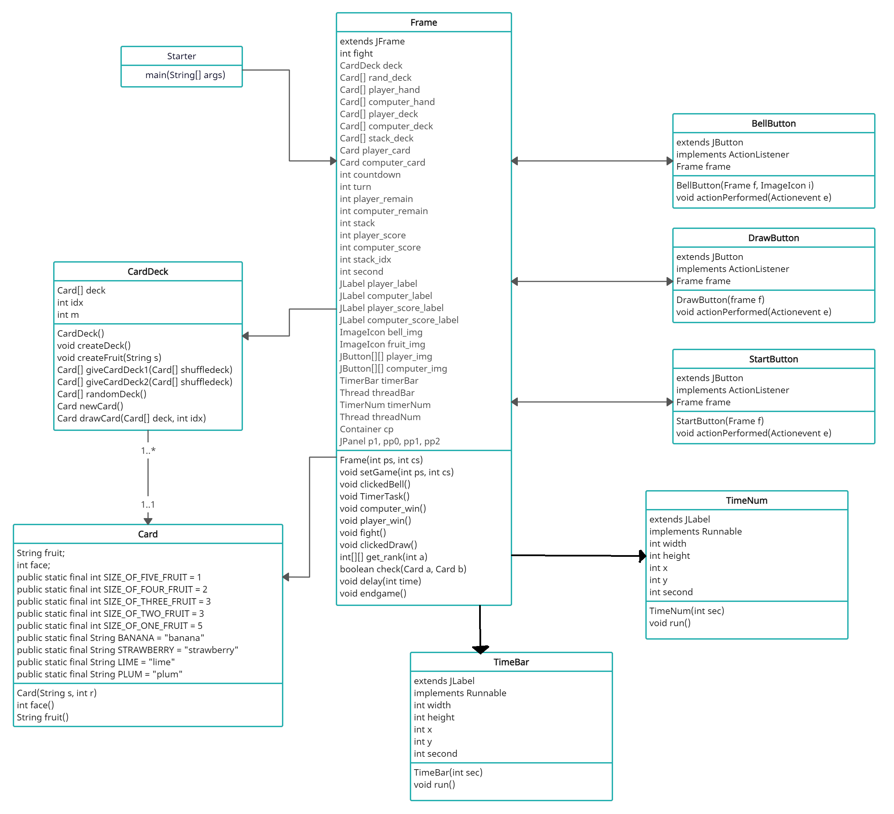

# GUI 기반의 할리갈리 게임 구현
## 할리갈리 룰 및 프로그램 동작 방식
 - #### 처음 시작 할리갈리 게임을 실행시키면 게임 난이도를 사용자에게 선택하라는 입력창이 뜬다. 
 - #### 상은 타이머의 시간을 1초로 설정, 중은 타이머의 시간을 2초로 설정, 하는 타이머의 시간을 3초로 설정. 
 - #### 이후 플레이어와 컴퓨터가 전체 56장의 카드를 랜덤하게 28장씩 나눠가진 뒤 게임을 진행할 frame이 화면에 출력된다. 
 - #### Draw 버튼을 누르면 처음에 플레이어가 먼저 카드를 내고 그 다음 Draw 버튼을 누르면 컴퓨터가 카드를 한 장 낸다. 
 - #### 이때 서로 제출한 카드의 과일의 종류가 같으면서 총합이 5개가 되는 순간 컴퓨터가 버튼을 누르는 동작을 대신하는 타이머가 나오고 그 타이머가 time out 상태에 이르기 전에 플레이어가 벨 버튼을 누르면 플레이가 지금까지 냈던 카드들을 모두 자신의 카드덱으로 가져간다. 
 - #### 만약 플레이어가 타이머가 time out 상태에 이르기 전에 벨 버튼을 누르지 못한다면 컴퓨터가 이긴 것으로 간주하고 컴퓨터의 카드덱에 지금까지 냈던 카드들을 모두 추가해준다.
 - #### 이런 방식으로 컴퓨터와 플레이어가 한 장씩 카드를 내다가 한 플레이어의 남은 카드 수가 0장이 되면 다른 플레이어가 계속 카드를 제출한다(같은 과일의 총합이 5개가 될 때까지). 
 - #### 최종적으로 둘 중 한 플레이어가 가진 카드 수가 0장이 되면  게임이 종료되고 56장의 카드를 가진 플레이어가 할리갈리 게임에 승리한다.
 
 ## 프로그램 클래스 다이어그램
 
 
 ## 프로그램 명세서
 * Card class : 할리갈리 게임에 필요한 카드덱의 카드들을 구성한다. 과일의 종류는 4종류가 있으며 과일의 종류마다 14장씩 구성되어 총 56장이다.
  * face() : 카드에 적힌 과일의 갯수를 리턴한다.
  * fruit() : 카드에 적힌 과일의 종류를 리턴한다.
  
* CardDeck class : Card class에서 만들어진 카드 56장을 모아 카드 배열인 카드덱을 생성한다.
 * createFruit(String s) : parameter로 과일의 이름을 입력받아 카드를 카드덱에 저장한다. 카드는 과일의 갯수가 1개인 카드 5장, 2개인 카드 3장, 3개인 카드 3장, 4개인 카드 2장, 5개인 카드 1장으로 생성된다.
 * createDeck() : createFruit() 메소드를 과일의 종류를 다르게 하여 총 4번 실행시켜 총 56장으로 구성되는 카드덱을 생성한다.
 * giveCardDeck(Card[] shuffledeck) : 플레이어의 카드덱을 리턴하는 메소드로 카드 배열 shuffledeck의 0~27번째의 카드가 plyaer_deck에 저장 후 리턴한다.
 * giveCardDeck(Card[] shuffledeck) : 컴퓨터의 카드덱을 리턴하는 메소드로 카드 배열 shuffledeck의 28~56번째의 카드가 computer_deck에 저장 후 리턴한다.
 * randomDeck() : 카드덱을 무작위로 섞은 다음 리턴한다.
 * newCard() : 카드덱에서 무작위로 한 장을 뽑는다. 뽑은 카드의 자리는 비워지지 않고 그 다음 카드로 채워지게 된다.
 
* Frame class : 전체적인 게임의 Frame과 GUI를 구성하며 Controller의 기능도 수행한다.
 * Frame(int ps, int cs) : Frame과 GUI를 생성하고 구성한다. 또한 메소드 실행 시 새로운 카드덱이 생성되며 랜덤으로 섞인 후 플레이어와 컴퓨터에게 28장씩 나누어 준다. parameter로는 플레이어와 컴퓨터의 스코어 점수를 받게 된다.
 * setGame(int ps, int cs) : 게임이 끝나고 플레이어가 게임을 계속하겠다고 했을 때 실행되는 메소드로 플레이어와 컴퓨터의 스코어 기록을 기록한 채 게임을 다시 시작한다.
 * clickedStart() : 플레이어가 Start 버튼을 눌렀을 때 실행되는 메소드로 게임을 완전 초기화하고 다시 시작한다.
 * clciekdBell() : 플레이어가 Bell 버튼을 클릭했을 때 실행되는 메소드로 필드에 놓인 카드가 벨을 누를 수 있는 상황일 때, 카운트를 진행하는 타이머가 아직 끝나지 않았을 때 플레이어가 벨을 누른 경우 player_win()을 실행하고 타이머를 종료한다.
 * 
